# Hệ thống đấu giá trực tuyến

## Mô tả bài toán và phạm vi
Xây dựng một hệ thống đấu giá trực tuyến theo mô hình Client/Server. Người dùng có thể đăng ký, đăng nhập, nạp/rút tiền, tạo phiên đấu giá cho sản phẩm, tham gia phòng đấu giá, đặt giá, mua ngay và theo dõi lịch sử đấu giá. Quản trị viên có thể theo dõi người dùng, khóa/mở khóa tài khoản, xem danh sách phiên đấu giá, hủy phiên đấu giá khi cần và thống kê doanh thu hệ thống.

Phạm vi hiện tại tập trung vào:
- Ứng dụng desktop JavaFX cho client.
- Server Java chạy TCP Socket, trao đổi dữ liệu JSON theo `Request`/`Response`.
- Lưu trữ dữ liệu bằng MySQL thông qua repository layer.
- Xử lý phiên đấu giá theo thời gian thực, đặt giá cạnh tranh, auto-bidding, thông báo real-time và lịch sử giá.

## Công nghệ sử dụng
| Thành phần | Công nghệ |
|:----------|:----------|
| Build tool | Gradle Wrapper `9.5.0` |
| Client UI | JavaFX `25`, FXML, CSS |
| Giao tiếp Client/Server | TCP Socket, JSON |
| Serialize/Deserialize | Gson `2.13.2` |
| Database | MySQL, JDBC, HikariCP |
| Bảo mật mật khẩu | BCrypt |
| Logging | SLF4J, Logback |
| Upload ảnh | Cloudinary |
| Đóng gói | Gradle Shadow JAR |
| Container | Docker, Docker Compose |
| Kiểm thử | JUnit 5, Mockito, Awaitility, H2 |

## Môi trường chạy và yêu cầu cài đặt
- JDK 25 hoặc tương thích với cấu hình JavaFX/Dockerfile hiện tại.
- MySQL server đã tạo database/schema phù hợp với các bảng `users`, `items`, `itemimages`, `auctions`, `auctionparticipants`, `bidtransactions`, `transactions`, `auto_bids`. Lưu ý code hiện có query trộn tên bảng chữ hoa/thường, nên môi trường MySQL nên dùng cấu hình không phân biệt hoa/thường tên bảng hoặc đồng bộ lại casing giữa code và schema trước khi chạy.
- Cloudinary account nếu dùng chức năng upload ảnh sản phẩm.
- Docker/Docker Compose nếu chạy server bằng container.

Các biến môi trường server cần có:

```bash
DB_URL=jdbc:mysql://<host>:<port>/<database>
DB_USERNAME=<mysql-user>
DB_PASSWORD=<mysql-password>
CLOUDINARY_CLOUD_NAME=<cloudinary-cloud-name>
CLOUDINARY_API_KEY=<cloudinary-api-key>
CLOUDINARY_API_SECRET=<cloudinary-api-secret>
```

Docker Compose còn hỗ trợ thêm:

```bash
LOG_LEVEL=INFO
TZ=Asia/Ho_Chi_Minh
```

## Cấu trúc thư mục và module chính
```text
auction/
├── common/                 # DTO, enum, protocol Request/Response dùng chung
├── server/                 # Server socket, handler, service, repository, model
├── client/                 # JavaFX client, controller, FXML, CSS, network client
├── docker/                 # Dockerfile, docker-compose.yml, server.jar
├── gradle/                 # Gradle wrapper files
├── build.gradle.kts        # Cấu hình Gradle root
└── settings.gradle.kts     # Khai báo module common/server/client
```

Các module chính:
- `common`: định nghĩa `ActionType`, `Request`, `Response`, `ResponseStatus`, DTO request/response và enum dùng chung giữa client/server.
- `server`: xử lý socket tại port `26676`, định tuyến request qua `MessageRouter`, triển khai nghiệp vụ qua các service và lưu trữ qua repository.
- `client`: ứng dụng JavaFX, quản lý scene/controller, gửi request đến server bằng `SocketClient`.
- `docker`: đóng gói và chạy server bằng JAR/container.

## Vị trí các file JAR
Sau khi build bằng Gradle Shadow, các file JAR nằm tại:

| File | Mục đích |
|:-----|:---------|
| `server/build/libs/server-1.0-SNAPSHOT-all.jar` | Fat JAR chạy server, đã kèm dependency |
| `client/build/libs/client-1.0-SNAPSHOT-all.jar` | Fat JAR chạy JavaFX client |
| `docker/server.jar` | Bản server JAR được copy sang thư mục Docker khi chạy `:server:shadowJar` |

Lệnh build:
- Server:

```bash
./gradlew :server:shadowJar
```

- Client:

```bash
./gradlew :client:shadowJar
```

## Hướng dẫn chạy Server/Client

### 1. Chuẩn bị database và biến môi trường
Tạo database MySQL và đảm bảo schema có các bảng mà server đang sử dụng. Sau đó cấu hình biến môi trường theo hệ điều hành đang dùng.

Cấu hình bảng cho MySQL:

```mysql
create database if not exists auction
    character set utf8mb4
    collate utf8mb4_unicode_ci;

use auction;

create table if not exists users
(
    id              char(36)                            not null,
    username        varchar(50)                         not null,
    password        char(60)                            not null,
    email           varchar(50)                         not null,
    role            varchar(20)                         not null,
    account_balance decimal(15, 2) default 0.00         not null,
    frozen_balance  decimal(15, 2) default 0.00         not null,
    created_at      timestamp null default current_timestamp,
    is_banned       tinyint(1)     default 0            not null,
    ban_until       timestamp(3)                        null,
    primary key (id),
    unique key uk_users_username (username),
    unique key uk_users_email (email)
) engine = InnoDB
  default charset = utf8mb4
  collate = utf8mb4_unicode_ci;

create table if not exists items
(
    id              char(36)                            not null,
    created_at      timestamp null default current_timestamp,
    updated_at      timestamp null default current_timestamp on update current_timestamp,
    owner_id        char(36)                            not null,
    name            varchar(100)                        not null,
    description     text                                null,
    item_type       varchar(30)                         not null,
    artist          varchar(100)                        null,
    creation_year   int                                 null,
    brand           varchar(100)                        null,
    warranty_period int                                 null,
    engine_type     varchar(50)                         null,
    mileage         int                                 null,
    conditions      varchar(20)                         not null,
    image_url       varchar(255)                        null,
    primary key (id),
    key idx_items_owner_id (owner_id),
    constraint fk_items_owner
        foreign key (owner_id) references users (id)
) engine = InnoDB
  default charset = utf8mb4
  collate = utf8mb4_unicode_ci;

create table if not exists auctions
(
    id                char(36)                            not null,
    item_id           char(36)                            not null,
    seller_id         char(36)                            not null,
    winner_id         char(36)                            null,
    start_time        timestamp(3)                        null,
    end_time          timestamp(3)                        null,
    starting_price    decimal(15, 2)                      not null,
    final_price       decimal(15, 2)                      null,
    status            varchar(20)                         not null,
    created_at        timestamp null default current_timestamp,
    minimum_increment decimal(15, 2) default 0.00         not null,
    buy_now_price     decimal(15, 2) default 0.00         not null,
    primary key (id),
    key idx_auctions_item_id (item_id),
    key idx_auctions_seller_id (seller_id),
    key idx_auctions_winner_id (winner_id),
    constraint fk_auctions_item
        foreign key (item_id) references items (id),
    constraint fk_auctions_seller
        foreign key (seller_id) references users (id),
    constraint fk_auctions_winner
        foreign key (winner_id) references users (id)
) engine = InnoDB
  default charset = utf8mb4
  collate = utf8mb4_unicode_ci;

create table if not exists auctionparticipants
(
    auction_id char(36) not null,
    user_id    char(36) not null,
    primary key (auction_id, user_id),
    key idx_auctionparticipants_user_id (user_id),
    constraint fk_auctionparticipants_auction
        foreign key (auction_id) references auctions (id)
            on delete cascade,
    constraint fk_auctionparticipants_user
        foreign key (user_id) references users (id)
            on delete cascade
) engine = InnoDB
  default charset = utf8mb4
  collate = utf8mb4_unicode_ci;

create table if not exists bidtransactions
(
    id         char(36)                            not null,
    auction_id char(36)                            not null,
    bidder_id  char(36)                            not null,
    bid_amount decimal(15, 2)                      not null,
    bid_time   timestamp null default current_timestamp,
    primary key (id),
    key idx_bidtransactions_auction_id (auction_id),
    key idx_bidtransactions_bidder_id (bidder_id),
    constraint fk_bidtransactions_auction
        foreign key (auction_id) references auctions (id),
    constraint fk_bidtransactions_bidder
        foreign key (bidder_id) references users (id)
) engine = InnoDB
  default charset = utf8mb4
  collate = utf8mb4_unicode_ci;

create table if not exists itemimages
(
    my_row_id bigint unsigned not null auto_increment,
    item_id   char(36)        not null,
    image_url text            not null,
    primary key (my_row_id),
    key idx_itemimages_item_id (item_id),
    constraint fk_itemimages_item
        foreign key (item_id) references items (id)
            on delete cascade
) engine = InnoDB
  default charset = utf8mb4
  collate = utf8mb4_unicode_ci;

create table if not exists transactions
(
    id               char(36)                            not null,
    user_id          char(36)                            not null,
    amount           decimal(15, 2)                      not null,
    transaction_time timestamp null default current_timestamp,
    transaction_type varchar(20)                         not null,
    primary key (id),
    key idx_transactions_user_id (user_id),
    constraint fk_transactions_user
        foreign key (user_id) references users (id)
) engine = InnoDB
  default charset = utf8mb4
  collate = utf8mb4_unicode_ci;

create table if not exists auto_bids
(
    bidder_id     varchar(36)                        not null,
    auction_id    varchar(36)                        not null,
    max_bid       decimal(15, 2)                     not null,
    increment     decimal(15, 2)                     not null,
    registered_at datetime default current_timestamp not null,
    primary key (bidder_id, auction_id),
    key idx_auto_bids_auction_id (auction_id)
) engine = InnoDB
  default charset = utf8mb4
  collate = utf8mb4_unicode_ci;
```

Linux/macOS, cấu hình tạm thời cho terminal hiện tại:

```bash
export DB_URL="your-database-url"
export DB_USERNAME="your-database-username"
export DB_PASSWORD="your-database-password"
export CLOUDINARY_CLOUD_NAME="your-cloud-name"
export CLOUDINARY_API_KEY="your-api-key"
export CLOUDINARY_API_SECRET="your-api-secret"
```

macOS, nếu muốn lưu cấu hình cho các terminal sau, thêm các dòng `export` ở trên vào `~/.zshrc`, sau đó reload:

```bash
source ~/.zshrc
```

Windows PowerShell, cấu hình tạm thời cho cửa sổ terminal hiện tại:

```powershell
$env:DB_URL="your-database-url"
$env:DB_USERNAME="your-database-username"
$env:DB_PASSWORD="your-database-password"
$env:CLOUDINARY_CLOUD_NAME="your-cloud-name"
$env:CLOUDINARY_API_KEY="your-api-key"
$env:CLOUDINARY_API_SECRET="your-api-secret"
```

Windows PowerShell, lưu lâu dài vào biến môi trường của user:

```powershell
setx DB_URL "your-database-url"
setx DB_USERNAME "your-database-username"
setx DB_PASSWORD "your-database-password"
setx CLOUDINARY_CLOUD_NAME "your-cloud-name"
setx CLOUDINARY_API_KEY "your-api-key"
setx CLOUDINARY_API_SECRET "your-api-secret"
```


### 2. Build project
```bash
./gradlew :server:shadowJar :client:shadowJar
```

### 3. Chạy Server trước
Chạy trực tiếp bằng JAR:

```bash
java -jar server/build/libs/server-1.0-SNAPSHOT-all.jar
```

Server lắng nghe tại port `26676`.

Hoặc chạy bằng Docker Compose từ image đã cấu hình trong `docker/docker-compose.yml`:

```bash
cd docker
docker compose up -d
```

Khi dùng Docker Compose, đặt các biến môi trường trong file `docker/.env`.

### 4. Chạy Client sau khi Server đã sẵn sàng
Chạy bằng Gradle:

```bash
./gradlew :client:run
```

Hoặc chạy bằng JAR:

```bash
java -jar client/build/libs/client-1.0-SNAPSHOT-all.jar
```

Lưu ý: client hiện đang kết nối tới host `20.255.57.143` port `26676` trong `client/src/main/java/vn/io/huangnosimp/Main.java`. Nếu chạy server local, cần đổi host này thành `localhost` hoặc địa chỉ server tương ứng trước khi chạy client.

## Kiểm thử
Chạy toàn bộ test:

```bash
./gradlew test
```

Chạy test theo module:

```bash
./gradlew :server:test
./gradlew :client:test
```

## Danh sách chức năng đã hoàn thành

### Chức năng bắt buộc
- Quản lý người dùng: đăng ký, đăng nhập, phân quyền `MEMBER`/`ADMIN`, hash mật khẩu bằng BCrypt, nạp/rút tiền, quản lý số dư và số tiền đang bị đóng băng khi đấu giá.
- Quản lý người dùng phía admin: xem danh sách thành viên, trạng thái online/offline/bị khóa, khóa/mở khóa tài khoản theo thời lượng.
- Quản lý sản phẩm: tạo sản phẩm theo loại `ART`, `ELECTRONICS`, `VEHICLE`, lưu thuộc tính riêng, tình trạng sản phẩm, ảnh sản phẩm và chuyển quyền sở hữu sau khi thanh toán.
- Chức năng đấu giá: tạo phiên đấu giá, lên lịch bắt đầu/kết thúc, tham gia/rời phòng, đặt giá, kiểm tra bước giá tối thiểu, đóng băng tiền người thắng hiện tại, hoàn tiền người bị vượt giá, hủy phiên, mua ngay và xử lý thanh toán khi phiên kết thúc.
- Xử lý lỗi và ngoại lệ: validate input, trả về `ResponseStatus`, bắt lỗi JSON/socket/database, log lỗi bằng SLF4J/Logback, rollback ví/sản phẩm/trạng thái đấu giá khi thao tác lưu trữ hoặc thanh toán thất bại.

### Chức năng nâng cao
- Auto-Bidding: đăng ký/hủy auto-bid, đặt giá tối đa và bước nhảy, tự xử lý cạnh tranh giữa nhiều cấu hình auto-bid.
- Gia hạn phiên đấu giá: nếu có bid trong 10 giây cuối, server gia hạn thời gian kết thúc thêm 60 giây và cập nhật lại timer.
- Bid History Visualization: API chi tiết phiên trả về `bidHistory` và `priceHistory`; client hiển thị lịch sử bid và dữ liệu biến động giá.
- Dashboard và thống kê: số dư, số phòng đang tham gia, phiên đang thắng, phiên bị vượt giá, phiên đã thắng, danh sách phiên public/posted/won/ended.
- Thông báo real-time: server gửi notification khi có bid mới, người dùng bị outbid, phiên bị hủy hoặc kết thúc.
- Upload ảnh qua Cloudinary: server cấp upload signature, client dùng cho ảnh sản phẩm khi tạo đấu giá.
- Docker deployment: có `Dockerfile`, `docker-compose.yml`, image server và log volume.

## Bảng phân chia công việc trong nhóm
| Thành viên | Công việc |
|:----------:|:---------:|
| Vũ Đức Hoàng | phát triển server core. setup docker, github actions workflow cho CI/CD |
| Phạm Huy Hiêu | viết test kiểm thử cho server core |
| Nguyễn Ngọc Huy | phát triển client core |
| Vũ Đình Giang | phát triển UI/UX cho client |

## Sơ đồ thiết kế lớp
Các lớp `*Handlers` trong sơ đồ đại diện cho các static nested handler bên trong `UserHandler`, `AuctionHandler`, `AdminHandler`, `AutoBidHandler`, `StatisticHandler` và `CloudinaryHandler`; mỗi handler triển khai `RequestHandler`.

```mermaid
classDiagram
direction TB

namespace Bootstrap {
  class Main {
    +main()
  }
}

namespace Protocol {
  class Request {
    -String requestId
    -ActionType action
    -Object data
  }
  class Response {
    -String requestId
    -ResponseStatus status
    -String message
    -Object data
  }
  class ActionType {
    <<enum>>
  }
  class ResponseStatus {
    <<enum>>
  }
}

namespace Network {
  class SocketServer {
    -int port
    -ExecutorService threadPool
    -MessageRouter messageRouter
    +start()
  }
  class ClientHandle {
    -Socket clientSocket
    -MessageRouter router
    -String userId
    -UserType userType
    +run()
    +sendResponse(Response)
    +sendRequest(Request)
    +close()
  }
  class ClientSessionManager {
    -Set activeClients
    -Map auctionRooms
    +joinRoom(String, ClientHandle)
    +leaveRoom(String, ClientHandle)
    +broadcastToRoom(String, Request)
    +sendToUser(String, Request)
    +banUser(String)
    +destroyRoom(String)
  }
}

namespace Controllers {
  class MessageRouter {
    -Map~ActionType, RequestHandler~ handlers
    +registerHandler(ActionType, RequestHandler)
    +route(Request, ClientHandle) Response
  }
  class RequestHandler {
    <<interface>>
    +handle(Request, ClientHandle) Response
  }
  class UserHandlers {
    <<handlerGroup>>
  }
  class AuctionHandlers {
    <<handlerGroup>>
  }
  class AdminHandlers {
    <<handlerGroup>>
  }
  class AutoBidHandlers {
    <<handlerGroup>>
  }
  class StatisticHandlers {
    <<handlerGroup>>
  }
  class CloudinaryHandlers {
    <<handlerGroup>>
  }
}

namespace Connections {
  class DatabaseConnection {
    -HikariDataSource dataSource
    +getConnection()
    +closePool()
  }
  class CloudinaryConnection {
    -String cloudName
    -String apiKey
    -String apiSecret
    +isConfigured() boolean
    +getImageUploadUrl() String
  }
}

namespace Services {
  class IUserService {
    <<interface>>
  }
  class IAuctionService {
    <<interface>>
  }
  class IAutoBidService {
    <<interface>>
  }
  class IItemService {
    <<interface>>
  }
  class IAdminService {
    <<interface>>
  }
  class IStatisticService {
    <<interface>>
  }
  class ICloudinaryService {
    <<interface>>
  }
  class UserService
  class AuctionService {
    -ConcurrentHashMap auctionLocks
  }
  class AutoBidService
  class ItemService
  class AdminService
  class StatisticService
  class CloudinaryService
  class NotificationService
  class AuctionScheduler {
    -ConcurrentHashMap startTimer
    -ConcurrentHashMap endTimer
    -ScheduledExecutorService scheduler
  }
}

namespace Repositories {
  class IUserRepository {
    <<interface>>
  }
  class IAuctionRepository {
    <<interface>>
  }
  class IAutoBidRepository {
    <<interface>>
  }
  class IItemRepository {
    <<interface>>
  }
  class ITransactionRepository {
    <<interface>>
  }
  class IAuctionParticipantsRepository {
    <<interface>>
  }
  class IBidTransactionRepository {
    <<interface>>
  }
  class IStatisticRepository {
    <<interface>>
  }
  class UserRepository
  class AuctionRepository
  class AutoBidRepository {
    -Map storage
  }
  class ItemRepository
  class TransactionRepository
  class AuctionParticipantsRepository
  class BidTransactionRepository
  class StatisticRepository
}

namespace DomainModels {
  class Entity {
    -String id
    -long updatedAt
    -long createdAt
  }
  class User {
    -String email
    -String password
    -String username
  }
  class Member {
    -double accountBalance
    -double frozenBalance
    -boolean isBanned
    -LocalDateTime banUntil
  }
  class Admin
  class Item {
    -String name
    -String ownerId
    -String description
    -ItemCondition condition
    -List imageUrl
  }
  class Art {
    -String artist
    -int creationYear
  }
  class Electronics {
    -String brand
    -int warrantyMonths
  }
  class Vehicle {
    -String engineType
    -int mileage
  }
  class Auction {
    -Item item
    -Member seller
    -String currentWinnerId
    -double currentPrice
    -double startPrice
    -long startTime
    -long endTime
    -AuctionStatus status
    -double minimumIncrement
    -double buyNowPrice
  }
  class BidTransaction {
    -String auctionId
    -String bidderId
    -double amount
  }
  class Transaction {
    -String userId
    -TransactionType transactionType
    -double amount
  }
  class AutoBidConfig {
    -Member bidder
    -Auction auction
    -double maxBid
    -double increment
    -LocalDateTime registeredAt
  }
}

namespace Utilities {
  class ItemFactory {
    +createItem() Item
  }
  class ModelMapper
  class SensitiveDataMasker
}

%% Bootstrap and request flow
Main ..> DatabaseConnection : initializes
Main ..> CloudinaryConnection : initializes
Main ..> MessageRouter : registers handlers
Main ..> SocketServer : starts

SocketServer *-- MessageRouter
SocketServer ..> ClientHandle : accepts clients
ClientHandle --> MessageRouter : routes requests
ClientHandle ..> ClientSessionManager : registers sessions
ClientSessionManager o-- ClientHandle
MessageRouter o-- RequestHandler
MessageRouter ..> ActionType
MessageRouter ..> ResponseStatus
RequestHandler ..> Request
RequestHandler ..> Response
RequestHandler ..> ClientHandle

%% Handler groups
RequestHandler <|.. UserHandlers
RequestHandler <|.. AuctionHandlers
RequestHandler <|.. AdminHandlers
RequestHandler <|.. AutoBidHandlers
RequestHandler <|.. StatisticHandlers
RequestHandler <|.. CloudinaryHandlers
UserHandlers --> IUserService
AuctionHandlers --> IAuctionService
AdminHandlers --> IAdminService
AutoBidHandlers --> IAutoBidService
StatisticHandlers --> IStatisticService
CloudinaryHandlers --> ICloudinaryService

%% Service implementations
IUserService <|.. UserService
IAuctionService <|.. AuctionService
IAutoBidService <|.. AutoBidService
IItemService <|.. ItemService
IAdminService <|.. AdminService
IStatisticService <|.. StatisticService
ICloudinaryService <|.. CloudinaryService

UserService --> IUserRepository
ItemService --> IItemRepository
ItemService ..> ItemFactory
AuctionService --> IAuctionRepository
AuctionService --> IUserService
AuctionService --> IItemService
AuctionService --> ITransactionRepository
AuctionService --> IAuctionParticipantsRepository
AuctionService --> IBidTransactionRepository
AuctionService --> IAutoBidService
AuctionService --> NotificationService
AuctionService --> AuctionScheduler
AuctionService ..> BidTransaction : records bids
AutoBidService --> IAutoBidRepository
AutoBidService --> IUserRepository
AutoBidService --> IAuctionRepository
AutoBidService --> IAuctionService
AdminService --> IUserRepository
AdminService --> IAuctionRepository
AdminService --> IAuctionService
AdminService ..> ClientSessionManager : ban and destroy rooms
AdminService ..> ModelMapper
StatisticService --> IStatisticRepository
CloudinaryService --> CloudinaryConnection
NotificationService ..> ClientSessionManager : push notifications
NotificationService ..> Request
AuctionScheduler --> IAuctionService

%% Repository implementations
IUserRepository <|.. UserRepository
IAuctionRepository <|.. AuctionRepository
IAutoBidRepository <|.. AutoBidRepository
IItemRepository <|.. ItemRepository
ITransactionRepository <|.. TransactionRepository
IAuctionParticipantsRepository <|.. AuctionParticipantsRepository
IBidTransactionRepository <|.. BidTransactionRepository
IStatisticRepository <|.. StatisticRepository

UserRepository --> DatabaseConnection
AuctionRepository --> DatabaseConnection
AuctionRepository --> IUserRepository
AuctionRepository --> IItemRepository
AutoBidRepository --> DatabaseConnection
AutoBidRepository --> IUserRepository
AutoBidRepository --> IAuctionRepository
ItemRepository --> DatabaseConnection
TransactionRepository --> DatabaseConnection
AuctionParticipantsRepository --> DatabaseConnection
BidTransactionRepository --> DatabaseConnection
StatisticRepository --> DatabaseConnection
ModelMapper ..> IUserRepository

%% Domain model inheritance
Entity <|-- User
Entity <|-- Item
Entity <|-- Auction
Entity <|-- BidTransaction
Entity <|-- Transaction
Entity <|-- AutoBidConfig
User <|-- Admin
User <|-- Member
Item <|-- Art
Item <|-- Electronics
Item <|-- Vehicle

%% Domain relationships
Auction *-- Item
Auction *-- Member : seller
AutoBidConfig --> Auction
AutoBidConfig --> Member
BidTransaction ..> Auction : auctionId
BidTransaction ..> Member : bidderId
Transaction ..> User : userId
ItemFactory ..> Art : creates
ItemFactory ..> Electronics : creates
ItemFactory ..> Vehicle : creates
```


