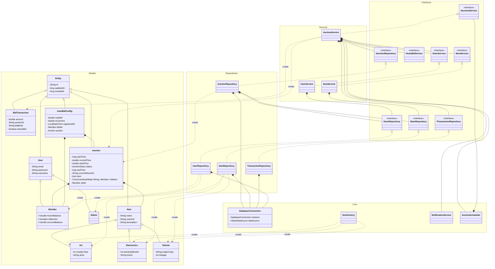

## Bảng phân chia công việc trong nhóm
| Thành viên | Công việc |
|:----------:|:---------:|
| Vũ Đức Hoàng | phát triển server core. setup docker, github actions workflow cho CI/CD |
| Phạm Huy Hiêu | viết test kiểm thử cho server core |
| Nguyễn Ngọc Huy | phát triển client core |
| Vũ Đình Giang | phát triển UI/UX cho client |

## Sơ đồ thiết kế lớp
